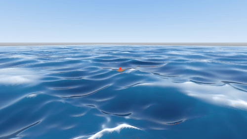
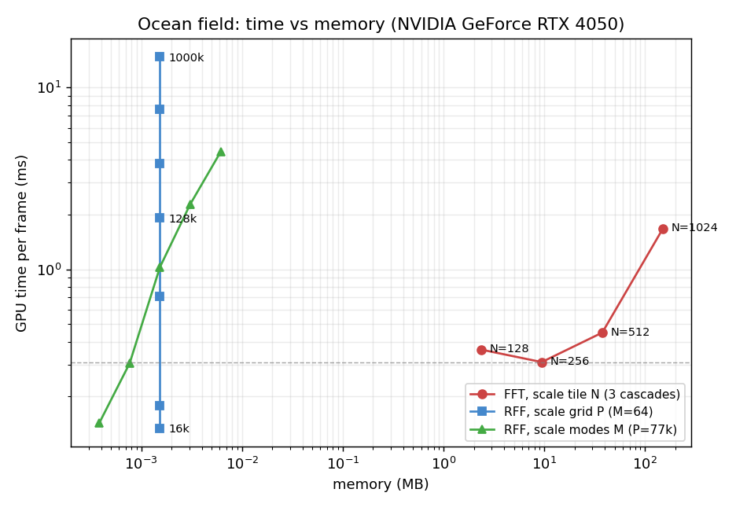

# Randomdorf

Real-valued ocean waves built from Random Fourier Features instead of an FFT, in Godot.

> WIP / experiment. It sums spectral wave components directly rather than running an FFT, to
> see how that compares with the usual FFT ocean and where it pays off. Still rough.



A Pierson-Moskowitz / JONSWAP spectrum sampled as M wave modes and summed in one spatial
shader, with analytic normals, Nyquist LOD, cheap buoyancy at any point, and a stylized
shading pass with foam. Sea state and foam are command-line flags (see Run).

## Idea

The standard Tessendorf ocean builds a Gaussian height field by inverse-FFT of an
oceanographic spectrum (Phillips, Pierson-Moskowitz, JONSWAP). That field is itself a sum of
sinusoids, so you can sample M wave components straight from the spectrum and add them per
vertex instead of transforming a full grid. Pick the modes from the spectrum (Wiener-Khinchin
/ random-phase model, the "RFF" view from kernel methods) and the statistics match. The wave
field fits in one spatial shader that does the displacement and the analytic normals.

`analysis/verify_rff.py` checks it against the spectrum: variance equals sigma^2,
autocovariance equals the analytic integral of F(k)*J0(kr), heights are Gaussian, and the
error drops as M^(-1/2).

## LOD

Because it is a sum of components, a level of detail simply drops the modes a tile's grid is
too coarse to resolve (Nyquist). It costs nothing extra and the seams stay closed: every mode
fades with distance the same way on both sides of a boundary, so the tiles line up. Grid
resolution scales with the render resolution. Rings coloured by level:


## RFF vs FFT, measured

On an RTX 4050 (`analysis/bench_gpu.py`):

| | FFT Tessendorf (3 cascades) | RFF (M=64, with LOD) |
|---|---|---|
| GPU / frame | ~0.55 ms | ~0.90 ms |
| Memory | 5 to 12 MB (spectra + maps) | ~2 KB (wave table) |
| Spectral detail | thousands of modes | 64 modes |
| Normals | extra transforms | analytic, free |
| Query any point (buoyancy) | sample a texture | direct h(x,z,t) |
| Tiling | repeats, needs blending to hide | seamless by construction |
| LOD | cascades / mip, awkward | drop modes, free |

FFT is faster and carries far more detail, and that is fundamental. One transform yields all
N^2 modes in O(N^2 log N), which works out to log R per output point against M for RFF, so for
a dense detailed field it wins outright. Production FFT oceans are also a solved, well-tooled
problem (see Tessendorf's notes, and Ubisoft's
[tiling-and-blending writeup](https://www.ubisoft.com/en-us/studio/laforge/news/5WHMK3tLGMGsqhxmWls1Jw/making-waves-in-ocean-surface-rendering-using-tiling-and-blending)
on the machinery used just to hide tile repetition).

RFF trades that throughput for memory and a simple pipeline: roughly 1000x less memory, a
single shader, exact analytic normals, the surface value at any point for cheap buoyancy,
coverage that stays seamless, and Nyquist LOD for free.

Use FFT for a detailed AAA ocean. Reach for RFF when memory or pipeline simplicity matter
(mobile, web, many small water bodies, lots of physics queries), or when you want seamless
coverage with cheap LOD.

Those numbers are the wave field alone. The full Godot scene shown here, with the shading
pass, foam, detail normal map, and reflection, measures about 2 to 3 ms at 720p on the RTX
4050; that cost applies on top of either wave method.

### Scaling to match the FFT

The FFT's tile size N sets coverage, memory, and time together, then tiles to fill any area.
RFF splits those into two knobs: grid size P (points evaluated) for coverage and speed, and
mode count M for spectral detail and memory. So matching the FFT in each sense lands on a
different knob (`analysis/pareto.py`, on the 4050; laptop clocks jitter, so read the shape).



- Match speed by grid: at the FFT's ~0.3 ms for three cascades (N=256, a 65k-point tile that
  repeats), RFF evaluates about 40k unique points, roughly 0.6x the tile and non-repeating.
  Same order of magnitude.
- Match memory by grid: not reachable. The RFF state is the wave table, about 1.5 KB at
  M=64, independent of grid size, so it stays roughly 6000x under the FFT's ~9 MB at any grid.
  Reaching the FFT's memory means scaling modes instead, into the hundreds of thousands, where
  the compute would cost seconds per frame.

On the plot, scaling RFF's grid moves it straight up (more time, flat memory) while scaling
the FFT tile moves it up and to the right. RFF stays about three orders of magnitude to the
left, which is the memory story; the FFT wins on coverage per millisecond because it tiles.

## Run

Godot 4.5+.

```
godot --path godot                    # ocean
godot --path godot -- --sea=storm     # calm, moderate, rough, storm, swell
godot --path godot -- --foam-buffer   # persistent foam accumulation
godot --path godot -- --lodview       # coloured LOD rings
```

`godot/run.sh` is a convenience launcher. On a hybrid laptop, render on the discrete GPU (for
example `prime-select nvidia`).

## Notes

- Shading is a stylized pass after the Sea of Thieves look: a deep colour blended with a
  subsurface colour by sun direction and a wave-peak mask, soft sky reflection, a sharp sun
  glint, and a tiling mipmapped normal map for the sub-metre ripple the mesh is too coarse to
  carry.
- Foam is a Jacobian-fold-plus-crest mask at breaking crests. `--foam-buffer` adds an optional
  persistent accumulation buffer (a decaying SubViewport) over a world-fixed region.
- Steepness is pushed past the physical PM significant wave height for looks.
- Deep-water dispersion only.

## Maybe later

- Shallow-water dispersion (tanh(kd)) for coastlines.
- A camera-following foam buffer that advects, instead of the current world-fixed region.
- Spray or whitecap particles on the steepest breaks.
